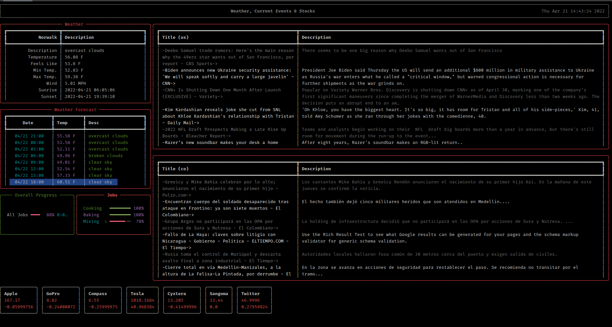

# Quick weather , News , Stocks and Currency Exchange CLI App

the application was created a quick and simple tool to speed a few web searches that I do every day.

the application uses 4 different API's to gather the information that I need.  

- OPEN WEATHER API -> https://openweathermap.org/api
- NEWS API -> https://newsapi.org/
- YAHOO FINANCIAL API -> https://www.yahoofinanceapi.com
- EXCHANGE RATES -> https://www.alphavantage.co

Weather : it fetches my current weather & the basic hourly forecast for the next few days.

News    : it gets the news headlines and a basic description from two countries.

Stocks  : it fetches some basic information about some stocks in the stock market.

Exchange: it fetches up to 5 current exchange rates

## How To Use:

1. Rename sample_variables_file.py to variables.py
2. go to each website listed below and get an sign up for an API key: 
   1. [OPEN WEATHER API](https://openweathermap.org/api)
   2. [NEWS API](https://newsapi.org/)
   3. [YAHOO FINANCIAL API](https://www.yahoofinanceapi.com)
   4. [EXCHANGE RATES](https://www.alphavantage.co)
3. Add the API keys on the variables file. Please fallow the notes on that page. 
4. Install the fallowing Python libraries/Packages:
   1. requests
   2. rich
5. You should be able to run the app now. 

### Documentation
API's:

   1. [OPEN WEATHER CURRENT](https://openweathermap.org/current)
   2. [OPEN WEATHER FORECAST](https://openweathermap.org/api/hourly-forecast)
   3. [NEWS API](https://newsapi.org/docs)
   4. [YAHOO FINANCIAL API](https://www.yahoofinanceapi.com/tutorial)
   5. [EXCHANGE RATES](https://www.alphavantage.co/documentation/)

Python Packages:
   1. [rich](https://rich.readthedocs.io/en/stable/introduction.html)
   2. [request](https://docs.python-requests.org/en/latest/)

